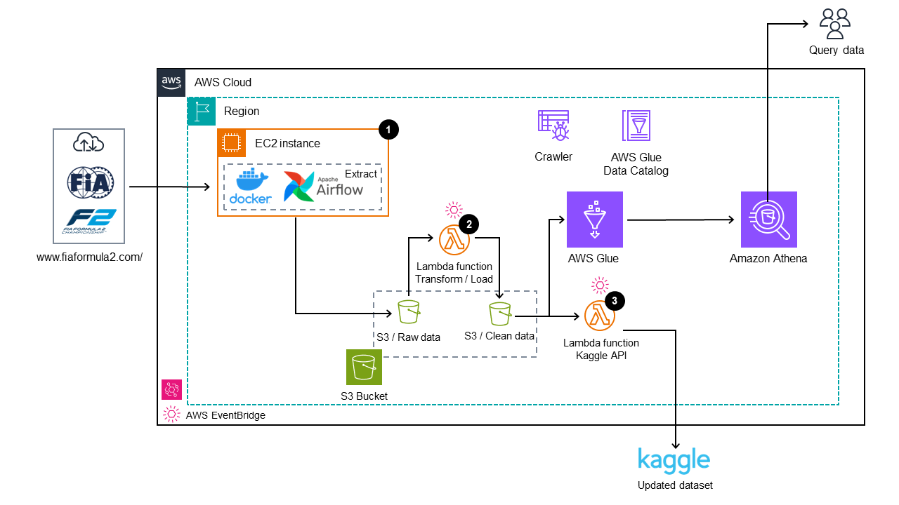

# Formula 2 End-to-End ETLT Pipeline
## Overview
This project aims to create an automated pipeline for extracting, transforming, and updating the Formula 2 dataset on Kaggle.
- **Data Source:** [www.fiaformula2.com](https://www.fiaformula2.com/)
- **Destination:** [Kaggle Dataset](https://www.kaggle.com/datasets/alarchemn/formula-2-dataset)

## Architecture

### Details
1. **Extraction**: Data is extracted from oficial F2 website using race IDs. The extracted data is stored in a `CSV` file in an AWS S3 bucket. The extraction process is orchestrated using Apache Airflow running in a Docker container on an AWS EC2 instance. Web scraping is performed using BeautifulSoup and Pandas.

2. **Transformation**: A Lambda function reads the raw race data from the S3 bucket and performs necessary transformations. The transformed data is then concatenated with the existing data and stored in another AWS S3 bucket. Pandas is used for the transformation process.

3. **Upload to Kaggle**: An additional Lambda function is triggered by AWS EventBridge to upload the updated data to Kaggle. The Kaggle API is utilized for this task. A new version of the dataset is created on Kaggle.

4. **Database Generation**: Optionally, AWS Glue can be used to generate a database from the updated dataset. This enables executing queries using Amazon Athena.

The pipeline enables regular updates of the Formula 2 dataset on Kaggle, ensuring that it remains up-to-date with the latest race information.

## Special requirements:
- Configure AWS account through AWS CLI (to interact with AWS)
- Configure AWS connection via Airflow UI
- Docker / Docker-Compose (to run Apache Airflow)
- AWS role with read/write S3 objects permission
- Kaggle API KEY
- Pandas layer for Lambda function

## Files Notes
- `f2-dag.py`: The argument for the data extraction is a list with the ID of each race in `str` format
- `utils.py`: Utility functions file, you can find the race IDs here
- `lambda_load.py`: Lambda function of transformation and load. PUT/GET permissions are required for to S3 bucket
- `draft.ipynb`: Notebook to test each function separately
- `test_dag_integrity.py`: Assess DAG integrity
- `\DATA\`: information cataloged by race_id, event and season

## Data description
Detailed description here: [Kaggle Dataset](https://www.kaggle.com/datasets/alarchemn/formula-2-dataset)
